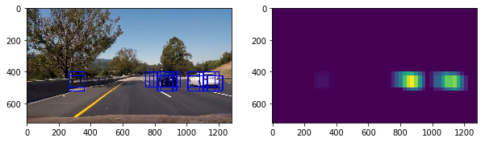

**Vehicle Detection Project**

The goals / steps of this project are the following:

* Perform a Histogram of Oriented Gradients (HOG) feature extraction on a labeled training set of images and train a classifier Linear SVM classifier
* Optionally, you can also apply a color transform and append binned color features, as well as histograms of color, to your HOG feature vector. 
* Note: for those first two steps don't forget to normalize your features and randomize a selection for training and testing.
* Implement a sliding-window technique and use your trained classifier to search for vehicles in images.
* Run your pipeline on a video stream (start with the test_video.mp4 and later implement on full project_video.mp4) and create a heat map of recurring detections frame by frame to reject outliers and follow detected vehicles.
* Estimate a bounding box for vehicles detected.

[//]: # (Image References)
[image1]: ./examples/car_not_car.png
[image2]: ./examples/HOG_example.jpg
[image3]: ./examples/sliding_windows.jpg
[image4]: ./examples/sliding_window.jpg
[image5]: ./examples/bboxes_and_heat.png
[image6]: ./examples/labels_map.png
[image7]: ./examples/output_bboxes.png
[video1]: ./project_video.mp4

## [Rubric](https://review.udacity.com/#!/rubrics/513/view) Points
###Here I will consider the rubric points individually and describe how I addressed each point in my implementation.  

---
###Writeup / README

####1. Provide a Writeup / README that includes all the rubric points and how you addressed each one.  You can submit your writeup as markdown or pdf.  [Here](https://github.com/udacity/CarND-Vehicle-Detection/blob/master/writeup_template.md) is a template writeup for this project you can use as a guide and a starting point.  

You're reading it!

###Histogram of Oriented Gradients (HOG)

####1. Explain how (and identify where in your code) you extracted HOG features from the training images.

The code for this step is contained in the `src/train_svm.py`

I started by reading in all the `vehicle` and `non-vehicle` images.  Here is an example of one of each of the `vehicle` and `non-vehicle` classes:

![alt text][image1]

I then explored different color spaces and different `skimage.hog()` parameters (`orientations`, `pixels_per_cell`, and `cells_per_block`).  I grabbed random images from each of the two classes and displayed them to get a feel for what the `skimage.hog()` output looks like.

Here is an example using the `YCrCb` color space and HOG parameters of `orientations=8`, `pixels_per_cell=(8, 8)` and `cells_per_block=(2, 2)`:

![alt text][image2]

####2. Explain how you settled on your final choice of HOG parameters and color features.

I tried various combinations of parameters and the end up with the following parameters which provide the best result of SVM classifier:

1.HOG (`get_hog_features()` in `src/features.py`) :

* orient = 9
* pix_per_cell = 8
* cell_per_block = 2
* cspace = YCrCb

2.Spatial Binning (`bin_spatial()` in `src/features.py`):

* nbins=32

3.Color histgrams (`color_hist()` in `src/features.py`):

* color_hist = 32

####3. Describe how (and identify where in your code) you trained a classifier using your selected HOG features and color features.

I trained a linear SVM using `LinearSVC` from scikit-learn. The code of this step is located at `src/train_svm.py` from line 82 to line 104.

First I stack the features of cars and not-cars, and generate the corespond labels.
Then I train a `StandardScaler` to proper scale each feature to a nomialized scale.
Then I split 20% of train data to be test data.
And I use the normalized train data to train the  LinearSVC, and get the score of accuracy on test set.
At last, I use pickle to dump the `LinearSVC` and `StrandardScaler` instance to file for future use. 

###Sliding Window Search

####1. Describe how (and identify where in your code) you implemented a sliding window search.  How did you decide what scales to search and how much to overlap windows?

I use Hog Sub-sampling Window Search for slide window search, for it's much efficient than silde window and can get higher overlap for it's only caculate the hog features for once.

The code is locate at `src/train_svm.py` from line 130 to 195.

It first generate hog for the whole image, then slide over the image by sub-sample the hog for the corresponding area. For each step it move 2 cells. Which get a overlap rate of 75% equavelent to slide window aproach.

Then I take the `LinearSVC` save in train steps to classify each window.

Here is a result after HOG Sub-sampling search

####2. Show some examples of test images to demonstrate how your pipeline is working.  What did you do to optimize the performance of your classifier?

I tried different combination of feature generation and parameters. At begining I tried to just use hog from 1 channel, svc gives 93% accuracy, then I use all channel hog, then get 95% accuracy. Then I take also the spatial features and color histogram features, then I get 98%.
Then I change the color space from RGB to YCrCb, which give me 99.45%.  At the end, I tried to nomalize the image by divide the image to 255, to make the value 0 to 1, and I get 99.58% accuracy.

Ultimately I searched on two scales using YCrCb 3-channel HOG features plus spatially binned color and histograms of color in the feature vector, which provided a nice result.  Here are some example images:

---

### Video Implementation

####1. Provide a link to your final video output.  Your pipeline should perform reasonably well on the entire project video (somewhat wobbly or unstable bounding boxes are ok as long as you are identifying the vehicles most of the time with minimal false positives.)
Here's a [link to my video result](./output_images/project_video.mp4)

####2. Describe how (and identify where in your code) you implemented some kind of filter for false positives and some method for combining overlapping bounding boxes.

This step is locate at `src/vehicle_detection.py` from line 189 to 205.

I recorded the positions of positive detections in each frame of the video.  From the positive detections I created a heatmap and then thresholded that map to identify vehicle positions.  I then used `scipy.ndimage.measurements.label()` to identify individual blobs in the heatmap.  I then assumed each blob corresponded to a vehicle.  I constructed bounding boxes to cover the area of each blob detected.  
And since I'm working on processing a video which get a series of frames, so that I can take a peorid of frames and sum them up so that I can stabilize the bounding box across time.
By trying different combination of peorid and threashold, my final choice is 25 frames which equivilent to 1s of frames and threshold at 20.

Here's an example result showing the heatmap from a series of frames of video, the result of `scipy.ndimage.measurements.label()` and the bounding boxes then overlaid on the last frame of video:

### Here are six frames and their corresponding heatmaps:

### Here is the output of `scipy.ndimage.measurements.label()` on the integrated heatmap from all six frames:

### Here the resulting bounding boxes are drawn onto the last frame in the series:

---

###Discussion

####1. Briefly discuss any problems / issues you faced in your implementation of this project.  Where will your pipeline likely fail?  What could you do to make it more robust?

Here I'll talk about the approach I took, what techniques I used, what worked and why, where the pipeline might fail and how I might improve it if I were going to pursue this project further.  

In this project, we learned how to do Vehicle Detection by use computer vision with machine learning techniques. By carefully choosing different combination of parameters, it show pretty good result.

The biggest issue of this approch is it's speed, where on my compute (4 core Haswell), it can process 1280x800 image at only 2 fps even after I use hog subsample aproach to calculate the hog features only once (if use raw slide window approach, only 0.4 fps), and also all the pipeline is not easily GPU acceleratable. And in real life, at least 24 fps is required to achieve a real time result with less powerful hardware confiuration.

One posible way that may imporve is to use deep learning model to replace, like the recently popular model [YOLO](https://pjreddie.com/darknet/yolo/) and [SSD](https://arxiv.org/abs/1512.02325), it's a replacement of RCNN for the case speed is matter, they can produce good result in realtime with GPU support, like the recently released platform `NVIDIA Jetson TX2` provide quite good computation power by GPU cores embedded.

Another problem is I think Linear SVM Classifier is not so scalable for realworld scenery. The real world is non-linear. For this problem, we can either choose a better kernel for SVM, or use CNN model. 

   
